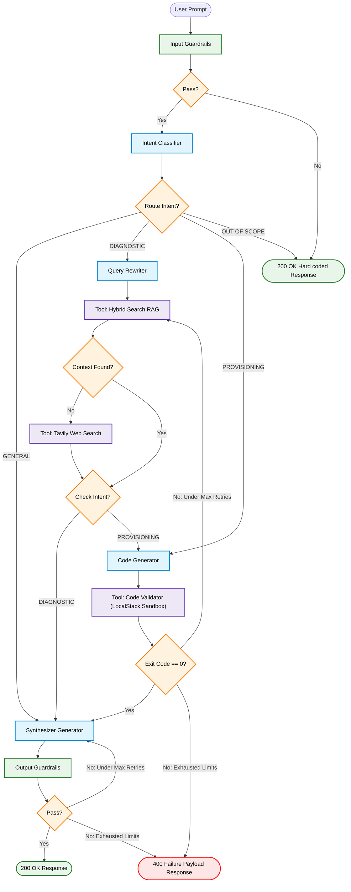

# AWS EC2 Corrective RAG (C-RAG) Agent 
                          

## Overview
An asynchronous DevOps AI Agent specialized in AWS EC2 infrastructure provisioning and error diagnosis.

##  System Architecture

  

## Tech Stack
* **Language:** Python 3.12+
* **API:** FastAPI, Pydantic v2, Alembic, SQLAlchemy v2, Uvicorn
* **Data Layer:** PostgreSQL with PGVector 
* **AI Orchestration:** LangChain, LangGraph, Groq, text-embedding-3-small
* **Observability**: LangSmith, Structlog 
* **Evaluation**: DeepEval, Pytest
* **DevOps:** Docker, Docker-Compose, GitHub Actions, LocalStack Engine


## Key Features 
*   **Intent Classifier:** An incoming query router that classifies user intent to optimize downstream token costs and minimize latency. [Completed ✅]
*   **Hybrid Search Vector & Keyword Pipeline:** A dual-retrieval strategy combining semantic embeddings (Dense) with exact keyword matching (Sparse / BM25) to eliminate retrieval gaps. [Completed ✅]
*   **Incremental Indexing Document Pipeline:** An active ingestion pipeline that tracks ingested documents, avoiding redundant document processing and updating the vector database only when new content is available. [Completed ✅]
*   **Corrective RAG (C-RAG) Architecture:** A self-corrective loop that evaluates retrieved document relevance and triggers a web-search fallback if retrieved internal documents are deemed insufficient. [In Progress]
*   **Input & Output Guardrails:** Ingestion and generation safety nets engineered to enforce data privacy, screen for bias, block prompt injection attempts and block toxic outputs before they reach the user. [In Progress]
*   **Chainlit UI Frontend:** A streamlined streaming user interface providing real-time visual progress updates of the graph execution alongside interactive source citations. [Completed ✅]
*   **Token Streaming:** Optimized token delivery utilizing Server-Sent Events (SSE) to achieve minimal Time-to-First-Token (TTFT). [Completed ✅]

## Quick Start (Local Deployment)

### Prerequisites
* Docker and Docker-Compose installed.
* Active API keys for Tavily and Groq.


### Running the System
1. Clone the repository and navigate to the folder:
   ```bash
   git clone https://github.com/stephanie-codehub/aws-crag-agent 
   cd aws-crag-agent
   ```

2. Rename the `.env.example` file in the root directory to `.env` and populate with your values
   ```bash
   cp .env.example .env
   ```

3. Start the API, PostgreSQL database, and LocalStack instances:
   ```bash
   docker-compose up --build
   ```

4. - Access API Docs (Swagger) at `http://localhost:8000/docs`
   - Chainlit User Interface at `http://localhost:8000/chat`

